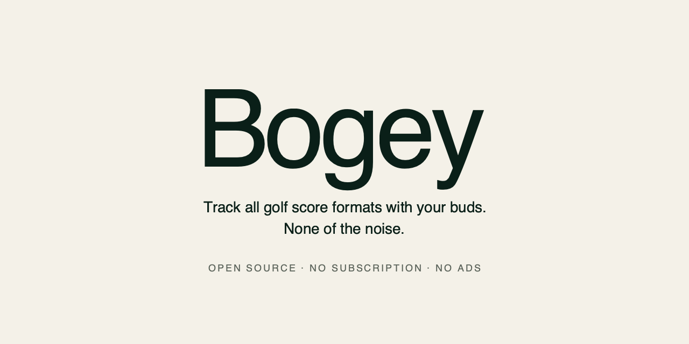
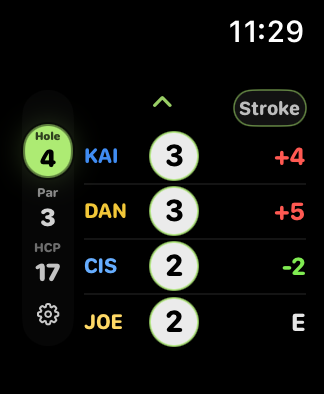
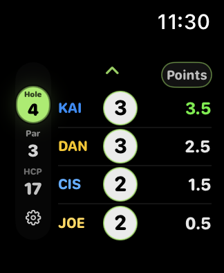
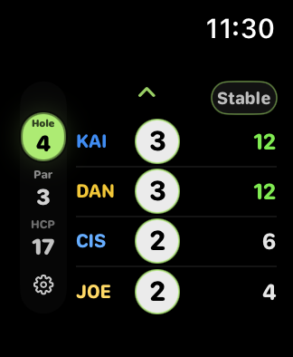

  

# Bogey

> Track all golf score formats with your buds. None of the noise.
> Open source, no subscription, no ads.

Bogey is a watch-first scorecard for golfers who play together. One to four players. Stroke play, match play, points match, and Stableford — gross or net. Big numbers on a dark screen. A letter per player.

No GPS shot tracking, no clubs database, no analytics, no coaching, no upsells. The discipline is the product.

## Open source. No subscription. No ads.

**Open source.** The full source is here. Read it, build it, change it. If something is broken or missing, open an issue or a pull request.

**No subscription.** Bogey is free. There is no premium tier and there will not be one.

**No ads.** Nothing is tracked, nothing is sold, nothing is sponsored. The app contains no advertising SDK.

## Screenshots

  
  &nbsp;&nbsp;
  
  &nbsp;&nbsp;
  

## Install

Coming soon to the App Store. Star this repo to follow along.

## Building from source

Requires Xcode 15.2 or later and a paired Apple Watch or watchOS 10.2+ simulator.

1. Clone the repo.
2. Open `BuddyGolf.xcodeproj` in Xcode.
3. Select the **BuddyGolf Watch App** scheme and your target device.
4. Build and run.

No external dependencies. No Swift packages to resolve, no CocoaPods, no Carthage.

Course data is fetched from a remote API on first launch. A bundled set of sample courses ships with the app, so it works from day one without a network connection.

## Contributing

See [CONTRIBUTING.md](CONTRIBUTING.md). For anything beyond a small bug fix, open an issue before sending a pull request.

## Privacy

Bogey collects no personal data. Score data is stored locally on the watch. See [PRIVACY.md](PRIVACY.md).

## License

MIT. See [LICENSE](LICENSE).

---

Built by [High Tee Society](https://ourexcuse.com). Find your fourball.
